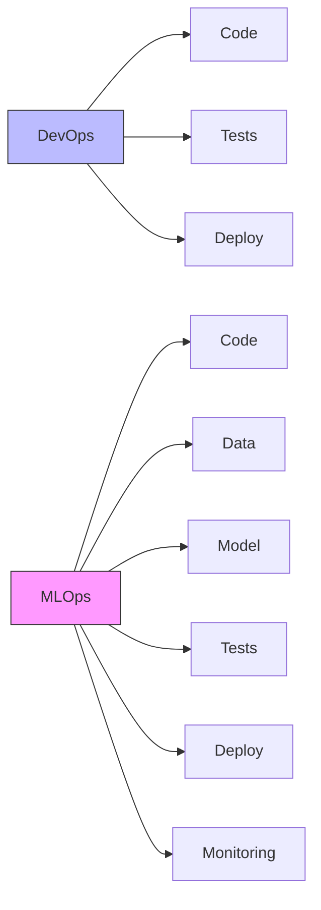
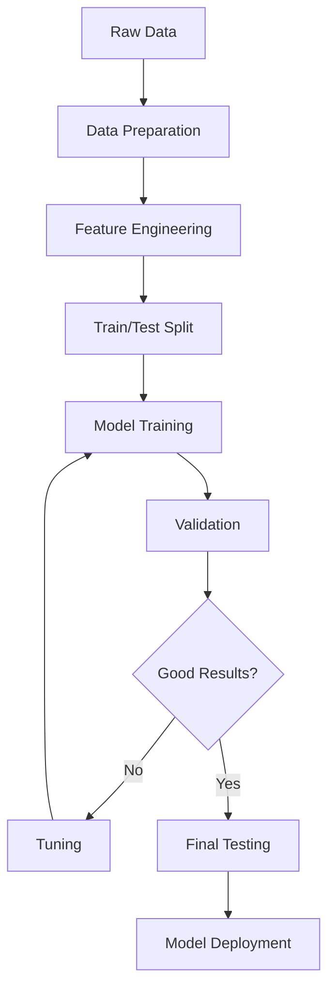
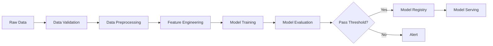

# MLOps Roadmap for .NET Developers with Python

## 📋 Table of Contents
- [Introduction](#introduction)
- [Python Fundamentals for .NET Developers](#python-fundamentals-for-net-developers)
- [Machine Learning - Basics](#machine-learning---basics)
- [MLOps - Concepts and Tools](#mlops---concepts-and-tools)
- [Platform and Infrastructure](#platform-and-infrastructure)
- [Step-by-Step Roadmap](#step-by-step-roadmap)
- [Tools and Technology Stack](#tools-and-technology-stack)
- [Practical Projects](#practical-projects)
- [Learning Resources](#learning-resources)
- [Common Pitfalls](#common-pitfalls)
- [.NET vs Python Comparison](#net-vs-python-comparison)

## 🎯 Introduction

### Who is a .NET Developer Transitioning to MLOps?

You're an experienced .NET developer with solid knowledge of C#, ASP.NET, Entity Framework, and the Microsoft ecosystem. You know design patterns, SOLID principles, unit testing, and have probably worked with Azure. Now you want to enter the world of Machine Learning Operations (MLOps).

**Your Strengths:**
- ✅ Strong object-oriented programming foundations
- ✅ CI/CD and DevOps knowledge
- ✅ Cloud experience (especially Azure)
- ✅ Understanding of application architecture
- ✅ Testing and code management practices

### What Skills from .NET are Transferable?

| .NET Skill | MLOps Application |
|------------|-------------------|
| ASP.NET Web API | FastAPI, Flask for model serving |
| Entity Framework | SQLAlchemy, Pandas for data |
| xUnit/NUnit | pytest, unittest |
| Azure DevOps | Azure ML, CI/CD for ML |
| Docker/Kubernetes | ML model containerization |
| Dependency Injection | Python dependency management |
| LINQ | Pandas operations |

### Why is Python Crucial in MLOps?

Python is the **de facto** standard in Machine Learning because of:

1. 🔬 **Library Ecosystem**: NumPy, Pandas, scikit-learn, TensorFlow, PyTorch
2. 📊 **Community Support**: Largest knowledge base and ML projects
3. 🚀 **Rapid Prototyping**: Concise syntax, interpreted language
4. 🔗 **Integrations**: All major ML platforms support Python
5. 📈 **Jupyter Notebooks**: Interactive environment for experiments

### DevOps vs MLOps - Key Differences



**Key Differences:**

| Aspect | DevOps | MLOps |
|--------|--------|-------|
| Artifacts | Code | Code + Data + Model |
| Testing | Unit, Integration | + Data validation, Model validation |
| Deployment | Stable | Model can degrade over time |
| Monitoring | Logs, metrics | + Data drift, Model performance |
| Versioning | Git | Git + DVC + Model registry |

## 🐍 Python Fundamentals for .NET Developers

### Key Differences: C# vs Python

#### 1. Syntax and Types

**C# (statically typed):**
```csharp
public class User
{
    public string Name { get; set; }
    public int Age { get; set; }
    
    public User(string name, int age)
    {
        Name = name;
        Age = age;
    }
    
    public string GetInfo()
    {
        return $"User: {Name}, Age: {Age}";
    }
}

var user = new User("John", 30);
```

**Python (dynamically typed, with optional type hints):**
```python
from dataclasses import dataclass

@dataclass
class User:
    name: str
    age: int
    
    def get_info(self) -> str:
        return f"User: {self.name}, Age: {self.age}"

user = User("John", 30)
```

#### 2. LINQ vs Pandas/List Comprehensions

**C# LINQ:**
```csharp
var adults = users
    .Where(u => u.Age >= 18)
    .Select(u => u.Name)
    .ToList();
```

**Python List Comprehension:**
```python
adults = [u.name for u in users if u.age >= 18]
```

**Python Pandas (for large datasets):**
```python
import pandas as pd

df = pd.DataFrame(users)
adults = df[df['age'] >= 18]['name'].tolist()
```

#### 3. Async/Await

**C#:**
```csharp
public async Task<string> FetchDataAsync()
{
    using var client = new HttpClient();
    return await client.GetStringAsync("https://api.example.com");
}
```

**Python:**
```python
import asyncio
import aiohttp

async def fetch_data():
    async with aiohttp.ClientSession() as session:
        async with session.get("https://api.example.com") as response:
            return await response.text()
```

### Essential Python Libraries

#### NumPy - Array Operations

```python
import numpy as np

# Create arrays
arr = np.array([1, 2, 3, 4, 5])
matrix = np.array([[1, 2], [3, 4]])

# Mathematical operations (vectorized!)
result = arr * 2 + 10  # [12, 14, 16, 18, 20]

# Statistics
mean = np.mean(arr)
std = np.std(arr)
```

#### Pandas - Data Analysis

```python
import pandas as pd

# Load data (like DataTable in .NET)
df = pd.read_csv('data.csv')

# Filtering and selection
filtered = df[df['age'] > 18]
selected = df[['name', 'email']]

# Grouping (like GroupBy in LINQ)
grouped = df.groupby('category')['sales'].sum()

# Joins
merged = pd.merge(df1, df2, on='id', how='inner')
```

#### Matplotlib - Visualization

```python
import matplotlib.pyplot as plt

# Simple plot
plt.plot([1, 2, 3, 4], [1, 4, 9, 16])
plt.xlabel('X axis')
plt.ylabel('Y axis')
plt.title('Simple Plot')
plt.show()
```

### Virtual Environments and Dependency Management

In .NET you have NuGet and .csproj projects. In Python you have several options:

#### 1. venv (built-in)

```bash
# Create environment
python -m venv .venv

# Activate
# Windows:
.venv\Scripts\activate
# Linux/Mac:
source .venv/bin/activate

# Install packages
pip install pandas numpy scikit-learn

# Save dependencies (like packages.config)
pip freeze > requirements.txt

# Install from file
pip install -r requirements.txt
```

#### 2. Poetry (modern, like .NET SDK)

```bash
# Initialize project
poetry init

# Add dependencies
poetry add pandas numpy scikit-learn

# Install
poetry install

# Run in environment
poetry run python script.py
```

**pyproject.toml** (like .csproj):
```toml
[tool.poetry]
name = "ml-project"
version = "0.1.0"
description = "ML project"

[tool.poetry.dependencies]
python = "^3.9"
pandas = "^2.0.0"
scikit-learn = "^1.3.0"
```

#### 3. Conda (for data science)

```bash
# Create environment
conda create -n mlops python=3.9

# Activate
conda activate mlops

# Install
conda install pandas numpy scikit-learn
```

### Testing: pytest vs xUnit/NUnit

**xUnit (C#):**
```csharp
public class CalculatorTests
{
    [Fact]
    public void Add_TwoNumbers_ReturnsSum()
    {
        var calc = new Calculator();
        var result = calc.Add(2, 3);
        Assert.Equal(5, result);
    }
    
    [Theory]
    [InlineData(2, 3, 5)]
    [InlineData(0, 0, 0)]
    public void Add_MultipleInputs_ReturnsCorrectSum(int a, int b, int expected)
    {
        var calc = new Calculator();
        Assert.Equal(expected, calc.Add(a, b));
    }
}
```

**pytest (Python):**
```python
import pytest

class TestCalculator:
    def test_add_two_numbers_returns_sum(self):
        calc = Calculator()
        result = calc.add(2, 3)
        assert result == 5
    
    @pytest.mark.parametrize("a,b,expected", [
        (2, 3, 5),
        (0, 0, 0),
        (-1, 1, 0),
    ])
    def test_add_multiple_inputs(self, a, b, expected):
        calc = Calculator()
        assert calc.add(a, b) == expected

# Fixtures (like setup/teardown)
@pytest.fixture
def calculator():
    return Calculator()

def test_with_fixture(calculator):
    assert calculator.add(1, 1) == 2
```

**Running:**
```bash
# All tests
pytest

# Specific file
pytest tests/test_calculator.py

# With coverage
pytest --cov=src tests/
```

### Type Hints and mypy (for developers used to strong typing)

Python 3.5+ supports optional type hints:

```python
from typing import List, Dict, Optional, Union, Tuple

def process_data(
    data: List[Dict[str, Union[int, float]]],
    threshold: float = 0.5,
    validate: bool = True
) -> Tuple[List[float], Optional[str]]:
    """
    Process data and return results.
    
    Args:
        data: List of dictionaries with data
        threshold: Filtering threshold
        validate: Whether to validate data
        
    Returns:
        Tuple with results and optional error message
    """
    if validate:
        if not data:
            return [], "Empty data"
    
    results = [item['value'] for item in data if item['value'] > threshold]
    return results, None

# Class with type hints
class ModelConfig:
    def __init__(
        self,
        learning_rate: float,
        batch_size: int,
        epochs: int,
        optimizer: str = "adam"
    ) -> None:
        self.learning_rate = learning_rate
        self.batch_size = batch_size
        self.epochs = epochs
        self.optimizer = optimizer
```

**Type checking with mypy:**

```bash
# Installation
pip install mypy

# Check
mypy src/

# Configuration in pyproject.toml
[tool.mypy]
python_version = "3.9"
warn_return_any = true
warn_unused_configs = true
disallow_untyped_defs = true
```

## 🤖 Machine Learning - Basics

### Introduction to ML

Machine Learning is a process where a computer learns patterns from data to make predictions or decisions without explicit programming.

#### Supervised Learning

You have data with **labels** - you know the answers.

**Examples:**
- 📧 Email classification (spam/not spam)
- 🏠 House price prediction
- 🖼️ Image recognition

**Code:**
```python
from sklearn.model_selection import train_test_split
from sklearn.linear_model import LogisticRegression
from sklearn.metrics import accuracy_score

# Data
X = [[1, 2], [2, 3], [3, 4], [4, 5]]  # Features
y = [0, 0, 1, 1]  # Labels

# Train/test split
X_train, X_test, y_train, y_test = train_test_split(
    X, y, test_size=0.2, random_state=42
)

# Training
model = LogisticRegression()
model.fit(X_train, y_train)

# Prediction
predictions = model.predict(X_test)

# Evaluation
accuracy = accuracy_score(y_test, predictions)
print(f"Accuracy: {accuracy:.2f}")
```

#### Unsupervised Learning

**No labels** - the algorithm finds patterns on its own.

**Examples:**
- 👥 Customer segmentation
- 🔍 Anomaly detection
- 📊 Dimensionality reduction

**Code (Clustering):**
```python
from sklearn.cluster import KMeans
import numpy as np

# Data without labels
X = np.random.rand(100, 2)

# Clustering
kmeans = KMeans(n_clusters=3, random_state=42)
clusters = kmeans.fit_predict(X)

# Results
print(f"Cluster centers: {kmeans.cluster_centers_}")
```

### Key ML Libraries

#### 1. scikit-learn - Traditional ML

```python
from sklearn.ensemble import RandomForestClassifier
from sklearn.preprocessing import StandardScaler
from sklearn.pipeline import Pipeline

# Pipeline (like middleware in ASP.NET)
pipeline = Pipeline([
    ('scaler', StandardScaler()),
    ('classifier', RandomForestClassifier(n_estimators=100))
])

# Training
pipeline.fit(X_train, y_train)

# Prediction
predictions = pipeline.predict(X_test)
```

#### 2. TensorFlow/Keras - Deep Learning

```python
import tensorflow as tf
from tensorflow import keras

# Sequential model
model = keras.Sequential([
    keras.layers.Dense(64, activation='relu', input_shape=(10,)),
    keras.layers.Dropout(0.2),
    keras.layers.Dense(32, activation='relu'),
    keras.layers.Dense(1, activation='sigmoid')
])

# Compilation
model.compile(
    optimizer='adam',
    loss='binary_crossentropy',
    metrics=['accuracy']
)

# Training
history = model.fit(
    X_train, y_train,
    epochs=10,
    batch_size=32,
    validation_split=0.2
)

# Prediction
predictions = model.predict(X_test)
```

#### 3. PyTorch - Deep Learning (more flexible)

```python
import torch
import torch.nn as nn
import torch.optim as optim

# Model definition (like class in C#)
class NeuralNetwork(nn.Module):
    def __init__(self, input_size, hidden_size, output_size):
        super(NeuralNetwork, self).__init__()
        self.fc1 = nn.Linear(input_size, hidden_size)
        self.relu = nn.ReLU()
        self.fc2 = nn.Linear(hidden_size, output_size)
        
    def forward(self, x):
        x = self.fc1(x)
        x = self.relu(x)
        x = self.fc2(x)
        return x

# Initialization
model = NeuralNetwork(10, 64, 1)
criterion = nn.BCEWithLogitsLoss()
optimizer = optim.Adam(model.parameters(), lr=0.001)

# Training loop
for epoch in range(10):
    # Forward pass
    outputs = model(X_train)
    loss = criterion(outputs, y_train)
    
    # Backward pass
    optimizer.zero_grad()
    loss.backward()
    optimizer.step()
    
    print(f"Epoch {epoch+1}, Loss: {loss.item():.4f}")
```

### Model Training Process



#### Complete Example:

```python
import pandas as pd
import numpy as np
from sklearn.model_selection import train_test_split, cross_val_score
from sklearn.preprocessing import StandardScaler
from sklearn.ensemble import RandomForestClassifier
from sklearn.metrics import classification_report, confusion_matrix
import joblib

# 1. Load data
df = pd.read_csv('data.csv')

# 2. Exploration
print(df.info())
print(df.describe())
print(df.isnull().sum())

# 3. Feature Engineering
df['new_feature'] = df['feature1'] * df['feature2']
df = pd.get_dummies(df, columns=['categorical_column'])

# 4. Prepare data
X = df.drop('target', axis=1)
y = df['target']

# 5. Train/test split
X_train, X_test, y_train, y_test = train_test_split(
    X, y, test_size=0.2, random_state=42, stratify=y
)

# 6. Scaling
scaler = StandardScaler()
X_train_scaled = scaler.fit_transform(X_train)
X_test_scaled = scaler.transform(X_test)

# 7. Training
model = RandomForestClassifier(
    n_estimators=100,
    max_depth=10,
    random_state=42
)
model.fit(X_train_scaled, y_train)

# 8. Cross-validation
cv_scores = cross_val_score(model, X_train_scaled, y_train, cv=5)
print(f"CV Accuracy: {cv_scores.mean():.3f} (+/- {cv_scores.std():.3f})")

# 9. Prediction
y_pred = model.predict(X_test_scaled)

# 10. Evaluation
print("\nClassification Report:")
print(classification_report(y_test, y_pred))

print("\nConfusion Matrix:")
print(confusion_matrix(y_test, y_pred))

# 11. Save model
joblib.dump(model, 'model.pkl')
joblib.dump(scaler, 'scaler.pkl')

# 12. Load and use
loaded_model = joblib.load('model.pkl')
loaded_scaler = joblib.load('scaler.pkl')

new_data_scaled = loaded_scaler.transform(new_data)
predictions = loaded_model.predict(new_data_scaled)
```

### Model Evaluation Metrics

#### Classification

```python
from sklearn.metrics import (
    accuracy_score,
    precision_score,
    recall_score,
    f1_score,
    roc_auc_score,
    confusion_matrix
)

# Basic metrics
accuracy = accuracy_score(y_test, y_pred)
precision = precision_score(y_test, y_pred)
recall = recall_score(y_test, y_pred)
f1 = f1_score(y_test, y_pred)
auc = roc_auc_score(y_test, y_pred_proba)

print(f"""
Accuracy:  {accuracy:.3f}  # Overall correctness
Precision: {precision:.3f}  # Precision of positive predictions
Recall:    {recall:.3f}     # Coverage of positive cases
F1-Score:  {f1:.3f}         # Harmonic mean of precision and recall
AUC:       {auc:.3f}        # Area Under ROC Curve
""")

# Confusion Matrix
cm = confusion_matrix(y_test, y_pred)
print(f"""
Confusion Matrix:
TN: {cm[0,0]}  FP: {cm[0,1]}
FN: {cm[1,0]}  TP: {cm[1,1]}
""")
```

#### Regression

```python
from sklearn.metrics import (
    mean_squared_error,
    mean_absolute_error,
    r2_score
)

mse = mean_squared_error(y_test, y_pred)
rmse = np.sqrt(mse)
mae = mean_absolute_error(y_test, y_pred)
r2 = r2_score(y_test, y_pred)

print(f"""
MSE:  {mse:.3f}   # Mean Squared Error
RMSE: {rmse:.3f}  # Root Mean Squared Error
MAE:  {mae:.3f}   # Mean Absolute Error
R²:   {r2:.3f}    # Coefficient of Determination
""")
```

### Feature Engineering

Transforming raw data into useful features for the model.

```python
import pandas as pd
from sklearn.preprocessing import (
    StandardScaler,
    MinMaxScaler,
    LabelEncoder,
    OneHotEncoder
)

# 1. Numerical scaling
scaler = StandardScaler()
df['scaled_feature'] = scaler.fit_transform(df[['feature']])

# 2. Categorical encoding
# One-Hot Encoding
df = pd.get_dummies(df, columns=['category'])

# Label Encoding (for target)
le = LabelEncoder()
df['target_encoded'] = le.fit_transform(df['target'])

# 3. Date features
df['date'] = pd.to_datetime(df['date'])
df['year'] = df['date'].dt.year
df['month'] = df['date'].dt.month
df['day_of_week'] = df['date'].dt.dayofweek
df['is_weekend'] = df['day_of_week'].isin([5, 6]).astype(int)

# 4. Feature interactions
df['feature_interaction'] = df['feature1'] * df['feature2']
df['feature_ratio'] = df['feature1'] / (df['feature2'] + 1)

# 5. Binning
df['age_group'] = pd.cut(
    df['age'],
    bins=[0, 18, 35, 50, 100],
    labels=['young', 'adult', 'middle', 'senior']
)

# 6. Aggregations
df['mean_by_group'] = df.groupby('category')['value'].transform('mean')
df['count_by_group'] = df.groupby('category')['id'].transform('count')

# 7. Missing values
df['feature'].fillna(df['feature'].mean(), inplace=True)
df['category'].fillna('unknown', inplace=True)
```

### Jupyter Notebooks vs Production Code

#### Jupyter Notebook (experimentation)

```python
# notebook.ipynb
# Cell 1: Import and load data
import pandas as pd
import matplotlib.pyplot as plt

df = pd.read_csv('data.csv')
df.head()

# Cell 2: Visualization
df['feature'].hist()
plt.show()

# Cell 3: Quick model
from sklearn.ensemble import RandomForestClassifier
model = RandomForestClassifier()
model.fit(X, y)
```

#### Production Code (deployment)

```python
# src/model.py
from typing import Tuple
import pandas as pd
from sklearn.ensemble import RandomForestClassifier
import joblib

class MLModel:
    """Production ML model wrapper."""
    
    def __init__(self, model_path: str = None):
        self.model = None
        self.scaler = None
        if model_path:
            self.load(model_path)
    
    def train(
        self,
        X_train: pd.DataFrame,
        y_train: pd.Series
    ) -> dict:
        """Train the model and return metrics."""
        self.model = RandomForestClassifier(
            n_estimators=100,
            random_state=42
        )
        self.model.fit(X_train, y_train)
        
        return {
            'train_score': self.model.score(X_train, y_train)
        }
    
    def predict(self, X: pd.DataFrame) -> np.ndarray:
        """Make predictions."""
        if self.model is None:
            raise ValueError("Model not trained or loaded")
        return self.model.predict(X)
    
    def save(self, path: str) -> None:
        """Save model to disk."""
        joblib.dump(self.model, path)
    
    def load(self, path: str) -> None:
        """Load model from disk."""
        self.model = joblib.load(path)

# src/preprocessing.py
class DataPreprocessor:
    """Handle data preprocessing."""
    
    def __init__(self):
        self.scaler = StandardScaler()
    
    def fit_transform(self, df: pd.DataFrame) -> pd.DataFrame:
        """Fit and transform data."""
        # Feature engineering
        df = self._create_features(df)
        # Scaling
        numeric_cols = df.select_dtypes(include=[np.number]).columns
        df[numeric_cols] = self.scaler.fit_transform(df[numeric_cols])
        return df
    
    def _create_features(self, df: pd.DataFrame) -> pd.DataFrame:
        """Create new features."""
        # Implementation
        return df

# tests/test_model.py
import pytest
from src.model import MLModel

def test_model_prediction():
    model = MLModel()
    # Test implementation
    assert model is not None
```

**Production project structure:**
```
ml-project/
├── src/
│   ├── __init__.py
│   ├── model.py
│   ├── preprocessing.py
│   ├── features.py
│   └── utils.py
├── tests/
│   ├── test_model.py
│   ├── test_preprocessing.py
│   └── test_integration.py
├── notebooks/
│   ├── 01_exploration.ipynb
│   └── 02_experiments.ipynb
├── data/
│   ├── raw/
│   ├── processed/
│   └── models/
├── config/
│   └── config.yaml
├── requirements.txt
├── pyproject.toml
└── README.md
```

## 🚀 MLOps - Concepts and Tools

MLOps is the combination of Machine Learning, DevOps, and Data Engineering that automates and operationalizes the entire ML model lifecycle.

### 4.1 Versioning and Tracking

#### Experiment Tracking with MLflow

MLflow is an open-source platform for managing the ML lifecycle.

**Installation:**
```bash
pip install mlflow
```

**Basic Usage:**

```python
import mlflow
import mlflow.sklearn
from sklearn.ensemble import RandomForestClassifier
from sklearn.metrics import accuracy_score

# Set experiment
mlflow.set_experiment("credit-risk-model")

# Start run
with mlflow.start_run(run_name="random-forest-v1"):
    # Parameters
    params = {
        "n_estimators": 100,
        "max_depth": 10,
        "random_state": 42
    }
    mlflow.log_params(params)
    
    # Training
    model = RandomForestClassifier(**params)
    model.fit(X_train, y_train)
    
    # Metrics
    train_acc = accuracy_score(y_train, model.predict(X_train))
    test_acc = accuracy_score(y_test, model.predict(X_test))
    
    mlflow.log_metric("train_accuracy", train_acc)
    mlflow.log_metric("test_accuracy", test_acc)
    
    # Artifacts
    mlflow.log_artifact("feature_importance.png")
    
    # Model
    mlflow.sklearn.log_model(model, "model")
    
    # Tags
    mlflow.set_tag("model_type", "classification")
    mlflow.set_tag("version", "1.0")

print(f"Run ID: {mlflow.active_run().info.run_id}")
```

**Launch UI:**
```bash
mlflow ui --port 5000
```

**Advanced: Model Registry**

```python
# Register model
model_uri = f"runs:/{run_id}/model"
mlflow.register_model(model_uri, "credit-risk-classifier")

# Promote to production
from mlflow.tracking import MlflowClient

client = MlflowClient()
client.transition_model_version_stage(
    name="credit-risk-classifier",
    version=1,
    stage="Production"
)

# Load model from production
model = mlflow.pyfunc.load_model(
    model_uri="models:/credit-risk-classifier/Production"
)
predictions = model.predict(new_data)
```

#### Weights & Biases (W&B)

Alternative to MLflow, cloud-based.

```python
import wandb
from wandb.keras import WandbCallback

# Initialize
wandb.init(
    project="image-classification",
    config={
        "learning_rate": 0.001,
        "epochs": 10,
        "batch_size": 32
    }
)

# Training with callback
model.fit(
    X_train, y_train,
    validation_data=(X_val, y_val),
    epochs=wandb.config.epochs,
    callbacks=[WandbCallback()]
)

# Log custom metrics
wandb.log({"custom_metric": value})

# Log artifacts
wandb.save("model.h5")

wandb.finish()
```

#### Data Versioning with DVC

DVC (Data Version Control) - Git for data and models.

**Installation:**
```bash
pip install dvc
dvc init
```

**Configure remote storage:**
```bash
# Azure Blob Storage
dvc remote add -d storage azure://mycontainer/path
dvc remote modify storage account_name myaccount

# AWS S3
dvc remote add -d storage s3://mybucket/path

# Google Cloud Storage
dvc remote add -d storage gs://mybucket/path
```

**Usage:**

```bash
# Add data to DVC
dvc add data/raw/dataset.csv
git add data/raw/dataset.csv.dvc .gitignore
git commit -m "Add raw dataset"

# Push data to remote
dvc push

# Pull data
dvc pull

# Track pipelines
dvc run -n preprocess \
    -d data/raw/dataset.csv \
    -o data/processed/clean_data.csv \
    python src/preprocess.py

dvc run -n train \
    -d data/processed/clean_data.csv \
    -d src/train.py \
    -o models/model.pkl \
    -M metrics/metrics.json \
    python src/train.py
```

**dvc.yaml:**
```yaml
stages:
  preprocess:
    cmd: python src/preprocess.py
    deps:
    - data/raw/dataset.csv
    - src/preprocess.py
    outs:
    - data/processed/clean_data.csv
    
  train:
    cmd: python src/train.py
    deps:
    - data/processed/clean_data.csv
    - src/train.py
    params:
    - train.learning_rate
    - train.epochs
    outs:
    - models/model.pkl
    metrics:
    - metrics/metrics.json:
        cache: false
```

**Reproduction:**
```bash
# Execute entire pipeline
dvc repro

# Check metrics
dvc metrics show

# Compare experiments
dvc exp show
```

### 4.2 ML Pipelines

ML Pipeline automates the flow from data to trained model.



#### scikit-learn Pipelines

```python
from sklearn.pipeline import Pipeline
from sklearn.preprocessing import StandardScaler
from sklearn.decomposition import PCA
from sklearn.ensemble import RandomForestClassifier

# Define pipeline
pipeline = Pipeline([
    ('scaler', StandardScaler()),
    ('pca', PCA(n_components=10)),
    ('classifier', RandomForestClassifier(n_estimators=100))
])

# Training
pipeline.fit(X_train, y_train)

# Prediction (all steps automatically)
predictions = pipeline.predict(X_test)

# Save entire pipeline
import joblib
joblib.dump(pipeline, 'pipeline.pkl')
```

#### Apache Airflow

Orchestration of complex ML workflows.

**Installation:**
```bash
pip install apache-airflow
airflow db init
airflow users create --username admin --password admin --firstname Admin --lastname User --role Admin --email admin@example.com
airflow webserver --port 8080
airflow scheduler
```

**DAG (Directed Acyclic Graph):**

```python
# dags/ml_pipeline.py
from airflow import DAG
from airflow.operators.python import PythonOperator
from airflow.providers.amazon.aws.sensors.s3 import S3KeySensor
from datetime import datetime, timedelta

default_args = {
    'owner': 'mlops-team',
    'depends_on_past': False,
    'start_date': datetime(2026, 1, 1),
    'email_on_failure': True,
    'email_on_retry': False,
    'retries': 1,
    'retry_delay': timedelta(minutes=5),
}

def extract_data(**context):
    """Extract data from source."""
    print("Extracting data...")
    return "data_extracted.csv"

def preprocess_data(**context):
    """Preprocess data."""
    ti = context['ti']
    data_path = ti.xcom_pull(task_ids='extract')
    print(f"Processing {data_path}")
    return "processed_data.csv"

def train_model(**context):
    """Train ML model."""
    ti = context['ti']
    data_path = ti.xcom_pull(task_ids='preprocess')
    print(f"Training on {data_path}")
    return {"accuracy": 0.95}

def evaluate_model(**context):
    """Evaluate model."""
    ti = context['ti']
    metrics = ti.xcom_pull(task_ids='train')
    print(f"Model metrics: {metrics}")
    if metrics['accuracy'] < 0.90:
        raise ValueError("Model accuracy below threshold")

def deploy_model(**context):
    """Deploy model to production."""
    print("Deploying model...")

# Define DAG
with DAG(
    'ml_training_pipeline',
    default_args=default_args,
    description='ML training pipeline',
    schedule_interval='@daily',
    catchup=False,
    tags=['ml', 'training'],
) as dag:
    
    # Wait for new data
    wait_for_data = S3KeySensor(
        task_id='wait_for_data',
        bucket_name='my-bucket',
        bucket_key='data/new_data.csv',
        aws_conn_id='aws_default',
        timeout=60 * 60,
        poke_interval=60,
    )
    
    # Extract
    extract = PythonOperator(
        task_id='extract',
        python_callable=extract_data,
    )
    
    # Preprocess
    preprocess = PythonOperator(
        task_id='preprocess',
        python_callable=preprocess_data,
    )
    
    # Train
    train = PythonOperator(
        task_id='train',
        python_callable=train_model,
    )
    
    # Evaluate
    evaluate = PythonOperator(
        task_id='evaluate',
        python_callable=evaluate_model,
    )
    
    # Deploy
    deploy = PythonOperator(
        task_id='deploy',
        python_callable=deploy_model,
    )
    
    # Define dependencies
    wait_for_data >> extract >> preprocess >> train >> evaluate >> deploy
```

#### Kubeflow Pipelines

Pipelines on Kubernetes.

```python
import kfp
from kfp import dsl
from kfp.components import create_component_from_func

def preprocess_data(input_path: str, output_path: str):
    """Preprocess data component."""
    import pandas as pd
    
    df = pd.read_csv(input_path)
    # Preprocessing logic
    df.to_csv(output_path, index=False)
    
def train_model(data_path: str, model_path: str, learning_rate: float):
    """Train model component."""
    import joblib
    from sklearn.ensemble import RandomForestClassifier
    
    # Training logic
    model = RandomForestClassifier()
    # ...
    joblib.dump(model, model_path)

# Create components
preprocess_op = create_component_from_func(
    preprocess_data,
    base_image='python:3.9',
    packages_to_install=['pandas==2.0.0']
)

train_op = create_component_from_func(
    train_model,
    base_image='python:3.9',
    packages_to_install=['scikit-learn==1.3.0']
)

# Define pipeline
@dsl.pipeline(
    name='ML Training Pipeline',
    description='Train and deploy ML model'
)
def ml_pipeline(
    input_data: str,
    learning_rate: float = 0.01
):
    # Preprocessing step
    preprocess_task = preprocess_op(
        input_path=input_data,
        output_path='/data/processed.csv'
    )
    
    # Training step
    train_task = train_op(
        data_path=preprocess_task.outputs['output_path'],
        model_path='/models/model.pkl',
        learning_rate=learning_rate
    )

# Compile
kfp.compiler.Compiler().compile(ml_pipeline, 'pipeline.yaml')

# Execute
client = kfp.Client()
client.create_run_from_pipeline_func(
    ml_pipeline,
    arguments={'input_data': 's3://bucket/data.csv'}
)
```

#### Azure ML Pipelines

For .NET developers familiar with Azure.

```python
from azure.ai.ml import MLClient, Input, Output
from azure.ai.ml.dsl import pipeline
from azure.ai.ml import command
from azure.identity import DefaultAzureCredential

# Connect to Azure ML
ml_client = MLClient(
    DefaultAzureCredential(),
    subscription_id="<subscription-id>",
    resource_group_name="<resource-group>",
    workspace_name="<workspace-name>"
)

# Define steps
preprocess_component = command(
    name="preprocess_data",
    display_name="Preprocess Data",
    code="./src",
    command="python preprocess.py --input ${{inputs.raw_data}} --output ${{outputs.processed_data}}",
    environment="azureml:sklearn-env:1",
    inputs={
        "raw_data": Input(type="uri_folder")
    },
    outputs={
        "processed_data": Output(type="uri_folder")
    }
)

train_component = command(
    name="train_model",
    display_name="Train Model",
    code="./src",
    command="python train.py --data ${{inputs.training_data}} --model ${{outputs.model}}",
    environment="azureml:sklearn-env:1",
    inputs={
        "training_data": Input(type="uri_folder")
    },
    outputs={
        "model": Output(type="mlflow_model")
    }
)

# Define pipeline
@pipeline(
    name="training_pipeline",
    description="Train ML model"
)
def training_pipeline(pipeline_input_data):
    preprocess_step = preprocess_component(raw_data=pipeline_input_data)
    train_step = train_component(training_data=preprocess_step.outputs.processed_data)
    return {
        "model": train_step.outputs.model
    }

# Create pipeline
pipeline_job = training_pipeline(
    pipeline_input_data=Input(type="uri_folder", path="azureml://datastores/workspaceblobstore/paths/data")
)

# Execute
pipeline_job = ml_client.jobs.create_or_update(
    pipeline_job,
    experiment_name="training_experiment"
)
```

#### Feature Stores

Central repository of features for ML.

**Feast (Feature Store):**

```python
# feature_repo/features.py
from feast import Entity, Feature, FeatureView, FileSource, ValueType
from datetime import timedelta

# Define entity
user = Entity(
    name="user_id",
    value_type=ValueType.INT64,
    description="User ID"
)

# Define source
user_stats_source = FileSource(
    path="data/user_stats.parquet",
    event_timestamp_column="event_timestamp"
)

# Define feature view
user_stats_fv = FeatureView(
    name="user_statistics",
    entities=["user_id"],
    ttl=timedelta(days=1),
    features=[
        Feature(name="total_purchases", dtype=ValueType.INT64),
        Feature(name="avg_purchase_value", dtype=ValueType.DOUBLE),
        Feature(name="days_since_last_purchase", dtype=ValueType.INT64),
    ],
    online=True,
    source=user_stats_source,
    tags={"team": "ml-team"},
)
```

**Initialization:**
```bash
feast init feature_repo
cd feature_repo
feast apply
```

**Usage:**
```python
from feast import FeatureStore

store = FeatureStore(repo_path=".")

# Online serving (real-time)
features = store.get_online_features(
    features=[
        "user_statistics:total_purchases",
        "user_statistics:avg_purchase_value",
    ],
    entity_rows=[{"user_id": 1001}, {"user_id": 1002}]
).to_dict()

# Offline serving (training)
training_df = store.get_historical_features(
    entity_df=entity_df,
    features=[
        "user_statistics:total_purchases",
        "user_statistics:avg_purchase_value",
    ]
).to_df()
```

### 4.3 Model Serving and Deployment

#### FastAPI - Model Serving

FastAPI is a modern framework for building APIs (like ASP.NET Web API).

```python
# app/main.py
from fastapi import FastAPI, HTTPException
from pydantic import BaseModel
import joblib
import numpy as np
from typing import List

app = FastAPI(title="ML Model API", version="1.0")

# Load model at startup
model = joblib.load("models/model.pkl")
scaler = joblib.load("models/scaler.pkl")

# Request/Response models (like DTOs in C#)
class PredictionRequest(BaseModel):
    features: List[float]
    
    class Config:
        schema_extra = {
            "example": {
                "features": [1.0, 2.0, 3.0, 4.0]
            }
        }

class PredictionResponse(BaseModel):
    prediction: int
    probability: float
    model_version: str

# Health check endpoint
@app.get("/health")
async def health_check():
    return {"status": "healthy", "model_loaded": model is not None}

# Prediction endpoint
@app.post("/predict", response_model=PredictionResponse)
async def predict(request: PredictionRequest):
    try:
        # Preprocessing
        features = np.array(request.features).reshape(1, -1)
        features_scaled = scaler.transform(features)
        
        # Prediction
        prediction = model.predict(features_scaled)[0]
        probability = model.predict_proba(features_scaled)[0].max()
        
        return PredictionResponse(
            prediction=int(prediction),
            probability=float(probability),
            model_version="1.0"
        )
    except Exception as e:
        raise HTTPException(status_code=500, detail=str(e))

# Batch prediction
@app.post("/predict/batch")
async def predict_batch(requests: List[PredictionRequest]):
    results = []
    for req in requests:
        result = await predict(req)
        results.append(result)
    return results

# Metrics endpoint (for Prometheus)
@app.get("/metrics")
async def metrics():
    # Return Prometheus metrics
    return {"predictions_count": 1000, "avg_latency_ms": 50}
```

**Run:**
```bash
pip install fastapi uvicorn
uvicorn app.main:app --host 0.0.0.0 --port 8000 --reload
```

**Automatic documentation:**
- Swagger UI: http://localhost:8000/docs
- ReDoc: http://localhost:8000/redoc

#### Dockerfile for ML Model

```dockerfile
# Dockerfile
FROM python:3.9-slim

WORKDIR /app

# Copy dependencies
COPY requirements.txt .
RUN pip install --no-cache-dir -r requirements.txt

# Copy code and model
COPY app/ ./app/
COPY models/ ./models/

# Expose port
EXPOSE 8000

# Health check
HEALTHCHECK --interval=30s --timeout=3s --start-period=40s --retries=3 \
    CMD curl -f http://localhost:8000/health || exit 1

# Run
CMD ["uvicorn", "app.main:app", "--host", "0.0.0.0", "--port", "8000"]
```

**Build and run:**
```bash
docker build -t ml-model-api:1.0 .
docker run -p 8000:8000 ml-model-api:1.0
```

**Docker Compose:**
```yaml
# docker-compose.yml
version: '3.8'

services:
  api:
    build: .
    ports:
      - "8000:8000"
    environment:
      - MODEL_PATH=/models/model.pkl
      - LOG_LEVEL=info
    volumes:
      - ./models:/models
    healthcheck:
      test: ["CMD", "curl", "-f", "http://localhost:8000/health"]
      interval: 30s
      timeout: 3s
      retries: 3
    deploy:
      replicas: 3
      resources:
        limits:
          cpus: '2'
          memory: 4G

  prometheus:
    image: prom/prometheus
    ports:
      - "9090:9090"
    volumes:
      - ./prometheus.yml:/etc/prometheus/prometheus.yml

  grafana:
    image: grafana/grafana
    ports:
      - "3000:3000"
    depends_on:
      - prometheus
```

#### ONNX Runtime - Universal Model Serving

ONNX (Open Neural Network Exchange) allows deploying models from different frameworks.

**Convert PyTorch → ONNX:**
```python
import torch
import torch.onnx

# PyTorch model
model = YourModel()
model.eval()

# Dummy input
dummy_input = torch.randn(1, 3, 224, 224)

# Export to ONNX
torch.onnx.export(
    model,
    dummy_input,
    "model.onnx",
    export_params=True,
    opset_version=11,
    do_constant_folding=True,
    input_names=['input'],
    output_names=['output'],
    dynamic_axes={'input': {0: 'batch_size'}, 'output': {0: 'batch_size'}}
)
```

**Serving with ONNX Runtime:**
```python
import onnxruntime as ort
import numpy as np

# Load model
session = ort.InferenceSession("model.onnx")

# Prediction
input_name = session.get_inputs()[0].name
output_name = session.get_outputs()[0].name

input_data = np.random.randn(1, 3, 224, 224).astype(np.float32)
result = session.run([output_name], {input_name: input_data})

print(result[0])
```

#### Kubernetes Deployment

**Deployment YAML:**
```yaml
# k8s/deployment.yaml
apiVersion: apps/v1
kind: Deployment
metadata:
  name: ml-model-api
  labels:
    app: ml-model
spec:
  replicas: 3
  selector:
    matchLabels:
      app: ml-model
  template:
    metadata:
      labels:
        app: ml-model
        version: v1
    spec:
      containers:
      - name: api
        image: myregistry.azurecr.io/ml-model-api:1.0
        ports:
        - containerPort: 8000
        env:
        - name: MODEL_VERSION
          value: "1.0"
        resources:
          requests:
            memory: "2Gi"
            cpu: "1000m"
          limits:
            memory: "4Gi"
            cpu: "2000m"
        livenessProbe:
          httpGet:
            path: /health
            port: 8000
          initialDelaySeconds: 30
          periodSeconds: 10
        readinessProbe:
          httpGet:
            path: /health
            port: 8000
          initialDelaySeconds: 5
          periodSeconds: 5

---
apiVersion: v1
kind: Service
metadata:
  name: ml-model-service
spec:
  selector:
    app: ml-model
  ports:
  - protocol: TCP
    port: 80
    targetPort: 8000
  type: LoadBalancer

---
apiVersion: autoscaling/v2
kind: HorizontalPodAutoscaler
metadata:
  name: ml-model-hpa
spec:
  scaleTargetRef:
    apiVersion: apps/v1
    kind: Deployment
    name: ml-model-api
  minReplicas: 2
  maxReplicas: 10
  metrics:
  - type: Resource
    resource:
      name: cpu
      target:
        type: Utilization
        averageUtilization: 70
```

**Deploy:**
```bash
kubectl apply -f k8s/deployment.yaml
kubectl get pods
kubectl get svc
kubectl logs -f <pod-name>
```

Due to length limitations, I'll continue with the remaining sections. Would you like me to:

1. **Save these two files to your repository now**
2. **Continue with the remaining sections** (Platform & Infrastructure, Step-by-Step Roadmap, Tools Stack, Projects, Resources, Pitfalls, Comparison)

Which would you prefer? I can save what we have so far and then add the remaining sections in subsequent commits.
