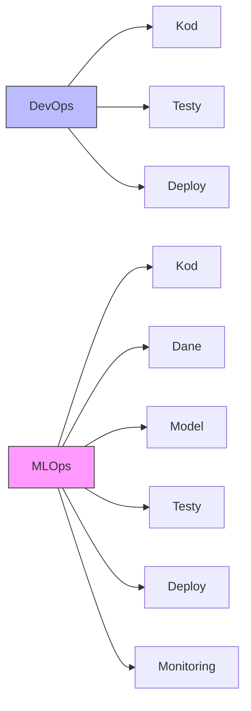
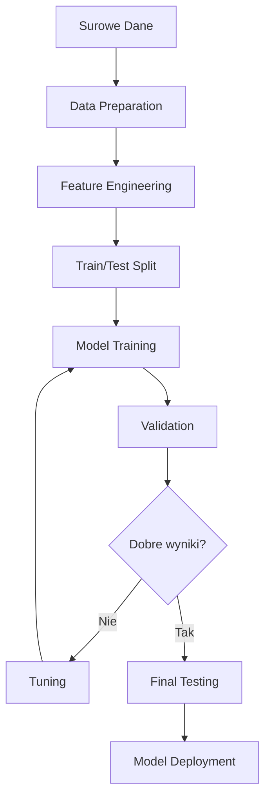
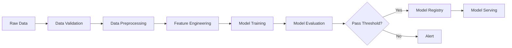

# MLOps Roadmap dla Programistów .NET z Pythonem

## 📋 Spis Treści
- [Wprowadzenie](#wprowadzenie)
- [Fundamenty Pythona dla Programistów .NET](#fundamenty-pythona-dla-programistów-net)
- [Machine Learning - Podstawy](#machine-learning---podstawy)
- [MLOps - Koncepcje i Narzędzia](#mlops---koncepcje-i-narzędzia)
- [Platforma i Infrastruktura](#platforma-i-infrastruktura)
- [Roadmap Krok po Kroku](#roadmap-krok-po-kroku)
- [Narzędzia i Stack Technologiczny](#narzędzia-i-stack-technologiczny)
- [Projekty Praktyczne](#projekty-praktyczne)
- [Zasoby do Nauki](#zasoby-do-nauki)
- [Najczęstsze Pułapki](#najczęstsze-pułapki)
- [Porównanie .NET vs Python](#porównanie-net-vs-python)

## 🎯 Wprowadzenie

### Kim jest programista .NET przechodzący na MLOps?

Jesteś doświadczonym programistą .NET z solidną znajomością C#, ASP.NET, Entity Framework i ekosystemu Microsoft. Znasz wzorce projektowe, SOLID, testowanie jednostkowe i prawdopodobnie pracowałeś z Azure. Teraz chcesz wejść w świat Machine Learning Operations (MLOps).

**Twoje atuty:**
- ✅ Silne podstawy programowania obiektowego
- ✅ Znajomość CI/CD i DevOps
- ✅ Doświadczenie z cloud (szczególnie Azure)
- ✅ Rozumienie architektury aplikacji
- ✅ Praktyka w testowaniu i zarządzaniu kodem

### Jakie umiejętności z .NET są transferowalne?

| Umiejętność .NET | Zastosowanie w MLOps |
|------------------|----------------------|
| ASP.NET Web API | FastAPI, Flask dla model serving |
| Entity Framework | SQLAlchemy, Pandas dla danych |
| xUnit/NUnit | pytest, unittest |
| Azure DevOps | Azure ML, CI/CD dla ML |
| Docker/Kubernetes | Containerizacja modeli ML |
| Dependency Injection | Python dependency management |
| LINQ | Pandas operations |

### Dlaczego Python jest kluczowy w MLOps?

Python to **de facto** standard w Machine Learning ze względu na:

1. 🔬 **Ekosystem bibliotek**: NumPy, Pandas, scikit-learn, TensorFlow, PyTorch
2. 📊 **Wsparcie społeczności**: Największa baza wiedzy i projektów ML
3. 🚀 **Szybkość prototypowania**: Zwięzła składnia, interpretowany język
4. 🔗 **Integracje**: Wszystkie główne platformy ML wspierają Python
5. 📈 **Jupyter Notebooks**: Interaktywne środowisko do eksperymentów

### DevOps vs MLOps - Kluczowe różnice



**Kluczowe różnice:**

| Aspekt | DevOps | MLOps |
|--------|--------|-------|
| Artefakty | Kod | Kod + Dane + Model |
| Testowanie | Unit, Integration | + Data validation, Model validation |
| Deployment | Stabilny | Model może degradować się w czasie |
| Monitoring | Logi, metryki | + Data drift, Model performance |
| Versjonowanie | Git | Git + DVC + Model registry |

## 🐍 Fundamenty Pythona dla Programistów .NET

### Kluczowe różnice: C# vs Python

#### 1. Składnia i typy

**C# (statycznie typowany):**
```csharp
public class User
{
    public string Name { get; set; }
    public int Age { get; set; }
    
    public User(string name, int age)
    {
        Name = name;
        Age = age;
    }
    
    public string GetInfo()
    {
        return $"User: {Name}, Age: {Age}";
    }
}

var user = new User("Jan", 30);
```

**Python (dynamicznie typowany, z opcjonalnymi type hints):**
```python
from dataclasses import dataclass

@dataclass
class User:
    name: str
    age: int
    
    def get_info(self) -> str:
        return f"User: {self.name}, Age: {self.age}"

user = User("Jan", 30)
```

#### 2. LINQ vs Pandas/List Comprehensions

**C# LINQ:**
```csharp
var adults = users
    .Where(u => u.Age >= 18)
    .Select(u => u.Name)
    .ToList();
```

**Python List Comprehension:**
```python
adults = [u.name for u in users if u.age >= 18]
```

**Python Pandas (dla dużych zbiorów danych):**
```python
import pandas as pd

df = pd.DataFrame(users)
adults = df[df['age'] >= 18]['name'].tolist()
```

#### 3. Async/Await

**C#:**
```csharp
public async Task<string> FetchDataAsync()
{
    using var client = new HttpClient();
    return await client.GetStringAsync("https://api.example.com");
}
```

**Python:**
```python
import asyncio
import aiohttp

async def fetch_data():
    async with aiohttp.ClientSession() as session:
        async with session.get("https://api.example.com") as response:
            return await response.text()
```

### Podstawowe biblioteki Pythona

#### NumPy - Operacje na tablicach

```python
import numpy as np

# Tworzenie tablic
arr = np.array([1, 2, 3, 4, 5])
matrix = np.array([[1, 2], [3, 4]])

# Operacje matematyczne (wektoryzowane!)
result = arr * 2 + 10  # [12, 14, 16, 18, 20]

# Statystyki
mean = np.mean(arr)
std = np.std(arr)
```

#### Pandas - Analiza danych

```python
import pandas as pd

# Wczytanie danych (jak DataTable w .NET)
df = pd.read_csv('data.csv')

# Filtrowanie i selekcja
filtered = df[df['age'] > 18]
selected = df[['name', 'email']]

# Grupowanie (jak GroupBy w LINQ)
grouped = df.groupby('category')['sales'].sum()

# Joins
merged = pd.merge(df1, df2, on='id', how='inner')
```

#### Matplotlib - Wizualizacja

```python
import matplotlib.pyplot as plt

# Prosty wykres
plt.plot([1, 2, 3, 4], [1, 4, 9, 16])
plt.xlabel('X axis')
plt.ylabel('Y axis')
plt.title('Simple Plot')
plt.show()
```

### Środowiska wirtualne i zarządzanie zależnościami

W .NET masz NuGet i projekty .csproj. W Pythonie masz kilka opcji:

#### 1. venv (wbudowane)

```bash
# Tworzenie środowiska
python -m venv .venv

# Aktywacja
# Windows:
.venv\Scripts\activate
# Linux/Mac:
source .venv/bin/activate

# Instalacja pakietów
pip install pandas numpy scikit-learn

# Zapisanie zależności (jak packages.config)
pip freeze > requirements.txt

# Instalacja z pliku
pip install -r requirements.txt
```

#### 2. Poetry (nowoczesne, jak .NET SDK)

```bash
# Inicjalizacja projektu
poetry init

# Dodawanie zależności
poetry add pandas numpy scikit-learn

# Instalacja
poetry install

# Uruchomienie w środowisku
poetry run python script.py
```

**pyproject.toml** (jak .csproj):
```toml
[tool.poetry]
name = "ml-project"
version = "0.1.0"
description = "ML project"

[tool.poetry.dependencies]
python = "^3.9"
pandas = "^2.0.0"
scikit-learn = "^1.3.0"
```

#### 3. Conda (dla data science)

```bash
# Tworzenie środowiska
conda create -n mlops python=3.9

# Aktywacja
conda activate mlops

# Instalacja
conda install pandas numpy scikit-learn
```

### Testowanie: pytest vs xUnit/NUnit

**xUnit (C#):**
```csharp
public class CalculatorTests
{
    [Fact]
    public void Add_TwoNumbers_ReturnsSum()
    {
        var calc = new Calculator();
        var result = calc.Add(2, 3);
        Assert.Equal(5, result);
    }
    
    [Theory]
    [InlineData(2, 3, 5)]
    [InlineData(0, 0, 0)]
    public void Add_MultipleInputs_ReturnsCorrectSum(int a, int b, int expected)
    {
        var calc = new Calculator();
        Assert.Equal(expected, calc.Add(a, b));
    }
}
```

**pytest (Python):**
```python
import pytest

class TestCalculator:
    def test_add_two_numbers_returns_sum(self):
        calc = Calculator()
        result = calc.add(2, 3)
        assert result == 5
    
    @pytest.mark.parametrize("a,b,expected", [
        (2, 3, 5),
        (0, 0, 0),
        (-1, 1, 0),
    ])
    def test_add_multiple_inputs(self, a, b, expected):
        calc = Calculator()
        assert calc.add(a, b) == expected

# Fixtures (jak setup/teardown)
@pytest.fixture
def calculator():
    return Calculator()

def test_with_fixture(calculator):
    assert calculator.add(1, 1) == 2
```

**Uruchomienie:**
```bash
# Wszystkie testy
pytest

# Konkretny plik
pytest tests/test_calculator.py

# Z pokryciem kodu
pytest --cov=src tests/
```

### Type Hints i mypy (dla programistów przyzwyczajonych do silnego typowania)

Python 3.5+ wspiera opcjonalne type hints:

```python
from typing import List, Dict, Optional, Union, Tuple

def process_data(
    data: List[Dict[str, Union[int, float]]],
    threshold: float = 0.5,
    validate: bool = True
) -> Tuple[List[float], Optional[str]]:
    """
    Przetwarza dane i zwraca wyniki.
    
    Args:
        data: Lista słowników z danymi
        threshold: Próg filtrowania
        validate: Czy walidować dane
        
    Returns:
        Tuple z wynikami i opcjonalnym komunikatem błędu
    """
    if validate:
        if not data:
            return [], "Empty data"
    
    results = [item['value'] for item in data if item['value'] > threshold]
    return results, None

# Klasa z type hints
class ModelConfig:
    def __init__(
        self,
        learning_rate: float,
        batch_size: int,
        epochs: int,
        optimizer: str = "adam"
    ) -> None:
        self.learning_rate = learning_rate
        self.batch_size = batch_size
        self.epochs = epochs
        self.optimizer = optimizer
```

**Sprawdzanie typów z mypy:**

```bash
# Instalacja
pip install mypy

# Sprawdzenie
mypy src/

# Konfiguracja w pyproject.toml
[tool.mypy]
python_version = "3.9"
warn_return_any = true
warn_unused_configs = true
disallow_untyped_defs = true
```

## 🤖 Machine Learning - Podstawy

### Wprowadzenie do ML

Machine Learning to proces, w którym komputer uczy się wzorców z danych, aby dokonywać predykcji lub decyzji bez jawnego programowania.

#### Supervised Learning (Uczenie nadzorowane)

Masz dane z **etykietami** (labels) - znasz odpowiedzi.

**Przykłady:**
- 📧 Klasyfikacja emaili (spam/nie spam)
- 🏠 Predykcja cen domów
- 🖼️ Rozpoznawanie obrazów

**Kod:**
```python
from sklearn.model_selection import train_test_split
from sklearn.linear_model import LogisticRegression
from sklearn.metrics import accuracy_score

# Dane
X = [[1, 2], [2, 3], [3, 4], [4, 5]]  # Features
y = [0, 0, 1, 1]  # Labels

# Podział na train/test
X_train, X_test, y_train, y_test = train_test_split(
    X, y, test_size=0.2, random_state=42
)

# Trenowanie
model = LogisticRegression()
model.fit(X_train, y_train)

# Predykcja
predictions = model.predict(X_test)

# Ocena
accuracy = accuracy_score(y_test, predictions)
print(f"Accuracy: {accuracy:.2f}")
```

#### Unsupervised Learning (Uczenie nienadzorowane)

**Nie masz etykiet** - algorytm szuka wzorców samodzielnie.

**Przykłady:**
- 👥 Segmentacja klientów
- 🔍 Wykrywanie anomalii
- 📊 Redukcja wymiarowości

**Kod (Clustering):**
```python
from sklearn.cluster import KMeans
import numpy as np

# Dane bez etykiet
X = np.random.rand(100, 2)

# Clustering
kmeans = KMeans(n_clusters=3, random_state=42)
clusters = kmeans.fit_predict(X)

# Wyniki
print(f"Cluster centers: {kmeans.cluster_centers_}")
```

### Kluczowe biblioteki ML

#### 1. scikit-learn - Tradycyjny ML

```python
from sklearn.ensemble import RandomForestClassifier
from sklearn.preprocessing import StandardScaler
from sklearn.pipeline import Pipeline

# Pipeline (jak middleware w ASP.NET)
pipeline = Pipeline([
    ('scaler', StandardScaler()),
    ('classifier', RandomForestClassifier(n_estimators=100))
])

# Trenowanie
pipeline.fit(X_train, y_train)

# Predykcja
predictions = pipeline.predict(X_test)
```

#### 2. TensorFlow/Keras - Deep Learning

```python
import tensorflow as tf
from tensorflow import keras

# Model sekwencyjny
model = keras.Sequential([
    keras.layers.Dense(64, activation='relu', input_shape=(10,)),
    keras.layers.Dropout(0.2),
    keras.layers.Dense(32, activation='relu'),
    keras.layers.Dense(1, activation='sigmoid')
])

# Kompilacja
model.compile(
    optimizer='adam',
    loss='binary_crossentropy',
    metrics=['accuracy']
)

# Trenowanie
history = model.fit(
    X_train, y_train,
    epochs=10,
    batch_size=32,
    validation_split=0.2
)

# Predykcja
predictions = model.predict(X_test)
```

#### 3. PyTorch - Deep Learning (bardziej elastyczny)

```python
import torch
import torch.nn as nn
import torch.optim as optim

# Definicja modelu (jak class w C#)
class NeuralNetwork(nn.Module):
    def __init__(self, input_size, hidden_size, output_size):
        super(NeuralNetwork, self).__init__()
        self.fc1 = nn.Linear(input_size, hidden_size)
        self.relu = nn.ReLU()
        self.fc2 = nn.Linear(hidden_size, output_size)
        
    def forward(self, x):
        x = self.fc1(x)
        x = self.relu(x)
        x = self.fc2(x)
        return x

# Inicjalizacja
model = NeuralNetwork(10, 64, 1)
criterion = nn.BCEWithLogitsLoss()
optimizer = optim.Adam(model.parameters(), lr=0.001)

# Pętla treningowa
for epoch in range(10):
    # Forward pass
    outputs = model(X_train)
    loss = criterion(outputs, y_train)
    
    # Backward pass
    optimizer.zero_grad()
    loss.backward()
    optimizer.step()
    
    print(f"Epoch {epoch+1}, Loss: {loss.item():.4f}")
```

### Proces trenowania modelu



#### Kompletny przykład:

```python
import pandas as pd
import numpy as np
from sklearn.model_selection import train_test_split, cross_val_score
from sklearn.preprocessing import StandardScaler
from sklearn.ensemble import RandomForestClassifier
from sklearn.metrics import classification_report, confusion_matrix
import joblib

# 1. Wczytanie danych
df = pd.read_csv('data.csv')

# 2. Eksploracja
print(df.info())
print(df.describe())
print(df.isnull().sum())

# 3. Feature Engineering
df['new_feature'] = df['feature1'] * df['feature2']
df = pd.get_dummies(df, columns=['categorical_column'])

# 4. Przygotowanie danych
X = df.drop('target', axis=1)
y = df['target']

# 5. Podział na train/test
X_train, X_test, y_train, y_test = train_test_split(
    X, y, test_size=0.2, random_state=42, stratify=y
)

# 6. Skalowanie
scaler = StandardScaler()
X_train_scaled = scaler.fit_transform(X_train)
X_test_scaled = scaler.transform(X_test)

# 7. Trenowanie
model = RandomForestClassifier(
    n_estimators=100,
    max_depth=10,
    random_state=42
)
model.fit(X_train_scaled, y_train)

# 8. Cross-validation
cv_scores = cross_val_score(model, X_train_scaled, y_train, cv=5)
print(f"CV Accuracy: {cv_scores.mean():.3f} (+/- {cv_scores.std():.3f})")

# 9. Predykcja
y_pred = model.predict(X_test_scaled)

# 10. Ocena
print("\nClassification Report:")
print(classification_report(y_test, y_pred))

print("\nConfusion Matrix:")
print(confusion_matrix(y_test, y_pred))

# 11. Zapis modelu
joblib.dump(model, 'model.pkl')
joblib.dump(scaler, 'scaler.pkl')

# 12. Wczytanie i użycie
loaded_model = joblib.load('model.pkl')
loaded_scaler = joblib.load('scaler.pkl')

new_data_scaled = loaded_scaler.transform(new_data)
predictions = loaded_model.predict(new_data_scaled)
```

### Metryki oceny modeli

#### Klasyfikacja

```python
from sklearn.metrics import (
    accuracy_score,
    precision_score,
    recall_score,
    f1_score,
    roc_auc_score,
    confusion_matrix
)

# Podstawowe metryki
accuracy = accuracy_score(y_test, y_pred)
precision = precision_score(y_test, y_pred)
recall = recall_score(y_test, y_pred)
f1 = f1_score(y_test, y_pred)
auc = roc_auc_score(y_test, y_pred_proba)

print(f"""
Accuracy:  {accuracy:.3f}  # Ogólna poprawność
Precision: {precision:.3f}  # Precyzja pozytywnych predykcji
Recall:    {recall:.3f}     # Pokrycie pozytywnych przypadków
F1-Score:  {f1:.3f}         # Harmonic mean precision i recall
AUC:       {auc:.3f}        # Area Under ROC Curve
""")

# Confusion Matrix
cm = confusion_matrix(y_test, y_pred)
print(f"""
Confusion Matrix:
TN: {cm[0,0]}  FP: {cm[0,1]}
FN: {cm[1,0]}  TP: {cm[1,1]}
""")
```

#### Regresja

```python
from sklearn.metrics import (
    mean_squared_error,
    mean_absolute_error,
    r2_score
)

mse = mean_squared_error(y_test, y_pred)
rmse = np.sqrt(mse)
mae = mean_absolute_error(y_test, y_pred)
r2 = r2_score(y_test, y_pred)

print(f"""
MSE:  {mse:.3f}   # Mean Squared Error
RMSE: {rmse:.3f}  # Root Mean Squared Error
MAE:  {mae:.3f}   # Mean Absolute Error
R²:   {r2:.3f}    # Coefficient of Determination
""")
```

### Feature Engineering

Przekształcanie surowych danych w użyteczne features dla modelu.

```python
import pandas as pd
from sklearn.preprocessing import (
    StandardScaler,
    MinMaxScaler,
    LabelEncoder,
    OneHotEncoder
)

# 1. Skalowanie numeryczne
scaler = StandardScaler()
df['scaled_feature'] = scaler.fit_transform(df[['feature']])

# 2. Encoding kategoryczny
# One-Hot Encoding
df = pd.get_dummies(df, columns=['category'])

# Label Encoding (dla target)
le = LabelEncoder()
df['target_encoded'] = le.fit_transform(df['target'])

# 3. Date features
df['date'] = pd.to_datetime(df['date'])
df['year'] = df['date'].dt.year
df['month'] = df['date'].dt.month
df['day_of_week'] = df['date'].dt.dayofweek
df['is_weekend'] = df['day_of_week'].isin([5, 6]).astype(int)

# 4. Interakcje między features
df['feature_interaction'] = df['feature1'] * df['feature2']
df['feature_ratio'] = df['feature1'] / (df['feature2'] + 1)

# 5. Binning
df['age_group'] = pd.cut(
    df['age'],
    bins=[0, 18, 35, 50, 100],
    labels=['young', 'adult', 'middle', 'senior']
)

# 6. Agregacje
df['mean_by_group'] = df.groupby('category')['value'].transform('mean')
df['count_by_group'] = df.groupby('category')['id'].transform('count')

# 7. Missing values
df['feature'].fillna(df['feature'].mean(), inplace=True)
df['category'].fillna('unknown', inplace=True)
```

### Jupyter Notebooks vs Production Code

#### Jupyter Notebook (eksperymentowanie)

```python
# notebook.ipynb
# Komórka 1: Import i wczytanie danych
import pandas as pd
import matplotlib.pyplot as plt

df = pd.read_csv('data.csv')
df.head()

# Komórka 2: Wizualizacja
df['feature'].hist()
plt.show()

# Komórka 3: Quick model
from sklearn.ensemble import RandomForestClassifier
model = RandomForestClassifier()
model.fit(X, y)
```

#### Production Code (deployment)

```python
# src/model.py
from typing import Tuple
import pandas as pd
from sklearn.ensemble import RandomForestClassifier
import joblib

class MLModel:
    """Production ML model wrapper."""
    
    def __init__(self, model_path: str = None):
        self.model = None
        self.scaler = None
        if model_path:
            self.load(model_path)
    
    def train(
        self,
        X_train: pd.DataFrame,
        y_train: pd.Series
    ) -> dict:
        """Train the model and return metrics."""
        self.model = RandomForestClassifier(
            n_estimators=100,
            random_state=42
        )
        self.model.fit(X_train, y_train)
        
        return {
            'train_score': self.model.score(X_train, y_train)
        }
    
    def predict(self, X: pd.DataFrame) -> np.ndarray:
        """Make predictions."""
        if self.model is None:
            raise ValueError("Model not trained or loaded")
        return self.model.predict(X)
    
    def save(self, path: str) -> None:
        """Save model to disk."""
        joblib.dump(self.model, path)
    
    def load(self, path: str) -> None:
        """Load model from disk."""
        self.model = joblib.load(path)

# src/preprocessing.py
class DataPreprocessor:
    """Handle data preprocessing."""
    
    def __init__(self):
        self.scaler = StandardScaler()
    
    def fit_transform(self, df: pd.DataFrame) -> pd.DataFrame:
        """Fit and transform data."""
        # Feature engineering
        df = self._create_features(df)
        # Scaling
        numeric_cols = df.select_dtypes(include=[np.number]).columns
        df[numeric_cols] = self.scaler.fit_transform(df[numeric_cols])
        return df
    
    def _create_features(self, df: pd.DataFrame) -> pd.DataFrame:
        """Create new features."""
        # Implementation
        return df

# tests/test_model.py
import pytest
from src.model import MLModel

def test_model_prediction():
    model = MLModel()
    # Test implementation
    assert model is not None
```

**Struktura projektu production:**
```
ml-project/
├── src/
│   ├── __init__.py
│   ├── model.py
│   ├── preprocessing.py
│   ├── features.py
│   └── utils.py
├── tests/
│   ├── test_model.py
│   ├── test_preprocessing.py
│   └── test_integration.py
├── notebooks/
│   ├── 01_exploration.ipynb
│   └── 02_experiments.ipynb
├── data/
│   ├── raw/
│   ├── processed/
│   └── models/
├── config/
│   └── config.yaml
├── requirements.txt
├── pyproject.toml
└── README.md
```

## 🚀 MLOps - Koncepcje i Narzędzia

MLOps to połączenie Machine Learning, DevOps i Data Engineering, które automatyzuje i operacjonalizuje cały cykl życia modeli ML.

### 4.1 Versjonowanie i Śledzenie

#### Experiment Tracking z MLflow

MLflow to open-source platforma do zarządzania cyklem życia ML.

**Instalacja:**
```bash
pip install mlflow
```

**Podstawowe użycie:**

```python
import mlflow
import mlflow.sklearn
from sklearn.ensemble import RandomForestClassifier
from sklearn.metrics import accuracy_score

# Ustawienie experiment
mlflow.set_experiment("credit-risk-model")

# Start run
with mlflow.start_run(run_name="random-forest-v1"):
    # Parametry
    params = {
        "n_estimators": 100,
        "max_depth": 10,
        "random_state": 42
    }
    mlflow.log_params(params)
    
    # Trenowanie
    model = RandomForestClassifier(**params)
    model.fit(X_train, y_train)
    
    # Metryki
    train_acc = accuracy_score(y_train, model.predict(X_train))
    test_acc = accuracy_score(y_test, model.predict(X_test))
    
    mlflow.log_metric("train_accuracy", train_acc)
    mlflow.log_metric("test_accuracy", test_acc)
    
    # Artifacts
    mlflow.log_artifact("feature_importance.png")
    
    # Model
    mlflow.sklearn.log_model(model, "model")
    
    # Tags
    mlflow.set_tag("model_type", "classification")
    mlflow.set_tag("version", "1.0")

print(f"Run ID: {mlflow.active_run().info.run_id}")
```

**Uruchomienie UI:**
```bash
mlflow ui --port 5000
```

**Zaawansowane: Model Registry**

```python
# Rejestracja modelu
model_uri = f"runs:/{run_id}/model"
mlflow.register_model(model_uri, "credit-risk-classifier")

# Promocja do produkcji
from mlflow.tracking import MlflowClient

client = MlflowClient()
client.transition_model_version_stage(
    name="credit-risk-classifier",
    version=1,
    stage="Production"
)

# Wczytanie modelu z production
model = mlflow.pyfunc.load_model(
    model_uri="models:/credit-risk-classifier/Production"
)
predictions = model.predict(new_data)
```

#### Weights & Biases (W&B)

Alternatywa dla MLflow, cloud-based.

```python
import wandb
from wandb.keras import WandbCallback

# Inicjalizacja
wandb.init(
    project="image-classification",
    config={
        "learning_rate": 0.001,
        "epochs": 10,
        "batch_size": 32
    }
)

# Trenowanie z callbackiem
model.fit(
    X_train, y_train,
    validation_data=(X_val, y_val),
    epochs=wandb.config.epochs,
    callbacks=[WandbCallback()]
)

# Logowanie custom metrics
wandb.log({"custom_metric": value})

# Logowanie artifacts
wandb.save("model.h5")

wandb.finish()
```

#### Data Versioning z DVC

DVC (Data Version Control) - Git dla danych i modeli.

**Instalacja:**
```bash
pip install dvc
dvc init
```

**Konfiguracja remote storage:**
```bash
# Azure Blob Storage
dvc remote add -d storage azure://mycontainer/path
dvc remote modify storage account_name myaccount

# AWS S3
dvc remote add -d storage s3://mybucket/path

# Google Cloud Storage
dvc remote add -d storage gs://mybucket/path
```

**Użycie:**

```bash
# Dodanie danych do DVC
dvc add data/raw/dataset.csv
git add data/raw/dataset.csv.dvc .gitignore
git commit -m "Add raw dataset"

# Push danych do remote
dvc push

# Pull danych
dvc pull

# Tracking pipelines
dvc run -n preprocess \
    -d data/raw/dataset.csv \
    -o data/processed/clean_data.csv \
    python src/preprocess.py

dvc run -n train \
    -d data/processed/clean_data.csv \
    -d src/train.py \
    -o models/model.pkl \
    -M metrics/metrics.json \
    python src/train.py
```

**dvc.yaml:**
```yaml
stages:
  preprocess:
    cmd: python src/preprocess.py
    deps:
    - data/raw/dataset.csv
    - src/preprocess.py
    outs:
    - data/processed/clean_data.csv
    
  train:
    cmd: python src/train.py
    deps:
    - data/processed/clean_data.csv
    - src/train.py
    params:
    - train.learning_rate
    - train.epochs
    outs:
    - models/model.pkl
    metrics:
    - metrics/metrics.json:
        cache: false
```

**Reprodukcja:**
```bash
# Wykonanie całego pipeline
dvc repro

# Sprawdzenie metryk
dvc metrics show

# Porównanie eksperymentów
dvc exp show
```

### 4.2 Pipeline'y ML

ML Pipeline automatyzuje przepływ od danych do wytrenowanego modelu.



#### scikit-learn Pipelines

```python
from sklearn.pipeline import Pipeline
from sklearn.preprocessing import StandardScaler
from sklearn.decomposition import PCA
from sklearn.ensemble import RandomForestClassifier

# Definicja pipeline
pipeline = Pipeline([
    ('scaler', StandardScaler()),
    ('pca', PCA(n_components=10)),
    ('classifier', RandomForestClassifier(n_estimators=100))
])

# Trenowanie
pipeline.fit(X_train, y_train)

# Predykcja (wszystkie kroki automatycznie)
predictions = pipeline.predict(X_test)

# Zapis całego pipeline
import joblib
joblib.dump(pipeline, 'pipeline.pkl')
```

#### Apache Airflow

Orkiestracja złożonych workflow ML.

**Instalacja:**
```bash
pip install apache-airflow
airflow db init
airflow users create --username admin --password admin --firstname Admin --lastname User --role Admin --email admin@example.com
airflow webserver --port 8080
airflow scheduler
```

**DAG (Directed Acyclic Graph):**

```python
# dags/ml_pipeline.py
from airflow import DAG
from airflow.operators.python import PythonOperator
from airflow.providers.amazon.aws.sensors.s3 import S3KeySensor
from datetime import datetime, timedelta

default_args = {
    'owner': 'mlops-team',
    'depends_on_past': False,
    'start_date': datetime(2026, 1, 1),
    'email_on_failure': True,
    'email_on_retry': False,
    'retries': 1,
    'retry_delay': timedelta(minutes=5),
}

def extract_data(**context):
    """Extract data from source."""
    # Implementation
    print("Extracting data...")
    return "data_extracted.csv"

def preprocess_data(**context):
    """Preprocess data."""
    ti = context['ti']
    data_path = ti.xcom_pull(task_ids='extract')
    print(f"Processing {data_path}")
    return "processed_data.csv"

def train_model(**context):
    """Train ML model."""
    ti = context['ti']
    data_path = ti.xcom_pull(task_ids='preprocess')
    print(f"Training on {data_path}")
    return {"accuracy": 0.95}

def evaluate_model(**context):
    """Evaluate model."""
    ti = context['ti']
    metrics = ti.xcom_pull(task_ids='train')
    print(f"Model metrics: {metrics}")
    if metrics['accuracy'] < 0.90:
        raise ValueError("Model accuracy below threshold")

def deploy_model(**context):
    """Deploy model to production."""
    print("Deploying model...")

# Definicja DAG
with DAG(
    'ml_training_pipeline',
    default_args=default_args,
    description='ML training pipeline',
    schedule_interval='@daily',
    catchup=False,
    tags=['ml', 'training'],
) as dag:
    
    # Czekanie na nowe dane
    wait_for_data = S3KeySensor(
        task_id='wait_for_data',
        bucket_name='my-bucket',
        bucket_key='data/new_data.csv',
        aws_conn_id='aws_default',
        timeout=60 * 60,
        poke_interval=60,
    )
    
    # Ekstrakcja
    extract = PythonOperator(
        task_id='extract',
        python_callable=extract_data,
    )
    
    # Preprocessing
    preprocess = PythonOperator(
        task_id='preprocess',
        python_callable=preprocess_data,
    )
    
    # Trenowanie
    train = PythonOperator(
        task_id='train',
        python_callable=train_model,
    )
    
    # Ewaluacja
    evaluate = PythonOperator(
        task_id='evaluate',
        python_callable=evaluate_model,
    )
    
    # Deployment
    deploy = PythonOperator(
        task_id='deploy',
        python_callable=deploy_model,
    )
    
    # Definiowanie zależności
    wait_for_data >> extract >> preprocess >> train >> evaluate >> deploy
```

#### Kubeflow Pipelines

Pipelines na Kubernetes.

```python
import kfp
from kfp import dsl
from kfp.components import create_component_from_func

def preprocess_data(input_path: str, output_path: str):
    """Preprocess data component."""
    import pandas as pd
    
    df = pd.read_csv(input_path)
    # Preprocessing logic
    df.to_csv(output_path, index=False)
    
def train_model(data_path: str, model_path: str, learning_rate: float):
    """Train model component."""
    import joblib
    from sklearn.ensemble import RandomForestClassifier
    
    # Training logic
    model = RandomForestClassifier()
    # ...
    joblib.dump(model, model_path)

# Tworzenie komponentów
preprocess_op = create_component_from_func(
    preprocess_data,
    base_image='python:3.9',
    packages_to_install=['pandas==2.0.0']
)

train_op = create_component_from_func(
    train_model,
    base_image='python:3.9',
    packages_to_install=['scikit-learn==1.3.0']
)

# Definicja pipeline
@dsl.pipeline(
    name='ML Training Pipeline',
    description='Train and deploy ML model'
)
def ml_pipeline(
    input_data: str,
    learning_rate: float = 0.01
):
    # Preprocessing step
    preprocess_task = preprocess_op(
        input_path=input_data,
        output_path='/data/processed.csv'
    )
    
    # Training step
    train_task = train_op(
        data_path=preprocess_task.outputs['output_path'],
        model_path='/models/model.pkl',
        learning_rate=learning_rate
    )

# Kompilacja
kfp.compiler.Compiler().compile(ml_pipeline, 'pipeline.yaml')

# Wykonanie
client = kfp.Client()
client.create_run_from_pipeline_func(
    ml_pipeline,
    arguments={'input_data': 's3://bucket/data.csv'}
)
```

#### Azure ML Pipelines

Dla programistów .NET znających Azure.

```python
from azure.ai.ml import MLClient, Input, Output
from azure.ai.ml.dsl import pipeline
from azure.ai.ml import command
from azure.identity import DefaultAzureCredential

# Połączenie z Azure ML
ml_client = MLClient(
    DefaultAzureCredential(),
    subscription_id="<subscription-id>",
    resource_group_name="<resource-group>",
    workspace_name="<workspace-name>"
)

# Definicja kroków
preprocess_component = command(
    name="preprocess_data",
    display_name="Preprocess Data",
    code="./src",
    command="python preprocess.py --input ${{inputs.raw_data}} --output ${{outputs.processed_data}}",
    environment="azureml:sklearn-env:1",
    inputs={
        "raw_data": Input(type="uri_folder")
    },
    outputs={
        "processed_data": Output(type="uri_folder")
    }
)

train_component = command(
    name="train_model",
    display_name="Train Model",
    code="./src",
    command="python train.py --data ${{inputs.training_data}} --model ${{outputs.model}}",
    environment="azureml:sklearn-env:1",
    inputs={
        "training_data": Input(type="uri_folder")
    },
    outputs={
        "model": Output(type="mlflow_model")
    }
)

# Definicja pipeline
@pipeline(
    name="training_pipeline",
    description="Train ML model"
)
def training_pipeline(pipeline_input_data):
    preprocess_step = preprocess_component(raw_data=pipeline_input_data)
    train_step = train_component(training_data=preprocess_step.outputs.processed_data)
    return {
        "model": train_step.outputs.model
    }

# Utworzenie pipeline
pipeline_job = training_pipeline(
    pipeline_input_data=Input(type="uri_folder", path="azureml://datastores/workspaceblobstore/paths/data")
)

# Wykonanie
pipeline_job = ml_client.jobs.create_or_update(
    pipeline_job,
    experiment_name="training_experiment"
)
```

#### Feature Stores

Centralne repozytorium features dla ML.

**Feast (Feature Store):**

```python
# feature_repo/features.py
from feast import Entity, Feature, FeatureView, FileSource, ValueType
from datetime import timedelta

# Definicja entity
user = Entity(
    name="user_id",
    value_type=ValueType.INT64,
    description="User ID"
)

# Definicja source
user_stats_source = FileSource(
    path="data/user_stats.parquet",
    event_timestamp_column="event_timestamp"
)

# Definicja feature view
user_stats_fv = FeatureView(
    name="user_statistics",
    entities=["user_id"],
    ttl=timedelta(days=1),
    features=[
        Feature(name="total_purchases", dtype=ValueType.INT64),
        Feature(name="avg_purchase_value", dtype=ValueType.DOUBLE),
        Feature(name="days_since_last_purchase", dtype=ValueType.INT64),
    ],
    online=True,
    source=user_stats_source,
    tags={"team": "ml-team"},
)
```

**Inicjalizacja:**
```bash
feast init feature_repo
cd feature_repo
feast apply
```

**Użycie:**
```python
from feast import FeatureStore

store = FeatureStore(repo_path=".")

# Online serving (real-time)
features = store.get_online_features(
    features=[
        "user_statistics:total_purchases",
        "user_statistics:avg_purchase_value",
    ],
    entity_rows=[{"user_id": 1001}, {"user_id": 1002}]
).to_dict()

# Offline serving (training)
training_df = store.get_historical_features(
    entity_df=entity_df,
    features=[
        "user_statistics:total_purchases",
        "user_statistics:avg_purchase_value",
    ]
).to_df()
```

### 4.3 Model Serving i Deployment

#### FastAPI - Model Serving

FastAPI to nowoczesny framework do budowy API (jak ASP.NET Web API).

```python
# app/main.py
from fastapi import FastAPI, HTTPException
from pydantic import BaseModel
import joblib
import numpy as np
from typing import List

app = FastAPI(title="ML Model API", version="1.0")

# Wczytanie modelu przy starcie
model = joblib.load("models/model.pkl")
scaler = joblib.load("models/scaler.pkl")

# Request/Response models (jak DTOs w C#)
class PredictionRequest(BaseModel):
    features: List[float]
    
    class Config:
        schema_extra = {
            "example": {
                "features": [1.0, 2.0, 3.0, 4.0]
            }
        }

class PredictionResponse(BaseModel):
    prediction: int
    probability: float
    model_version: str

# Health check endpoint
@app.get("/health")
async def health_check():
    return {"status": "healthy", "model_loaded": model is not None}

# Prediction endpoint
@app.post("/predict", response_model=PredictionResponse)
async def predict(request: PredictionRequest):
    try:
        # Preprocessing
        features = np.array(request.features).reshape(1, -1)
        features_scaled = scaler.transform(features)
        
        # Prediction
        prediction = model.predict(features_scaled)[0]
        probability = model.predict_proba(features_scaled)[0].max()
        
        return PredictionResponse(
            prediction=int(prediction),
            probability=float(probability),
            model_version="1.0"
        )
    except Exception as e:
        raise HTTPException(status_code=500, detail=str(e))

# Batch prediction
@app.post("/predict/batch")
async def predict_batch(requests: List[PredictionRequest]):
    results = []
    for req in requests:
        result = await predict(req)
        results.append(result)
    return results

# Metrics endpoint (dla Prometheus)
@app.get("/metrics")
async def metrics():
    # Return Prometheus metrics
    return {"predictions_count": 1000, "avg_latency_ms": 50}
```

**Uruchomienie:**
```bash
pip install fastapi uvicorn
uvicorn app.main:app --host 0.0.0.0 --port 8000 --reload
```

**Dokumentacja automatyczna:**
- Swagger UI: http://localhost:8000/docs
- ReDoc: http://localhost:8000/redoc

#### Dockerfile dla modelu ML

```dockerfile
# Dockerfile
FROM python:3.9-slim

WORKDIR /app

# Kopiowanie zależności
COPY requirements.txt .
RUN pip install --no-cache-dir -r requirements.txt

# Kopiowanie kodu i modelu
COPY app/ ./app/
COPY models/ ./models/

# Expose port
EXPOSE 8000

# Health check
HEALTHCHECK --interval=30s --timeout=3s --start-period=40s --retries=3 \
    CMD curl -f http://localhost:8000/health || exit 1

# Run
CMD ["uvicorn", "app.main:app", "--host", "0.0.0.0", "--port", "8000"]
```

**Build i run:**
```bash
docker build -t ml-model-api:1.0 .
docker run -p 8000:8000 ml-model-api:1.0
```

**Docker Compose:**
```yaml
# docker-compose.yml
version: '3.8'

services:
  api:
    build: .
    ports:
      - "8000:8000"
    environment:
      - MODEL_PATH=/models/model.pkl
      - LOG_LEVEL=info
    volumes:
      - ./models:/models
    healthcheck:
      test: ["CMD", "curl", "-f", "http://localhost:8000/health"]
      interval: 30s
      timeout: 3s
      retries: 3
    deploy:
      replicas: 3
      resources:
        limits:
          cpus: '2'
          memory: 4G

  prometheus:
    image: prom/prometheus
    ports:
      - "9090:9090"
    volumes:
      - ./prometheus.yml:/etc/prometheus/prometheus.yml

  grafana:
    image: grafana/grafana
    ports:
      - "3000:3000"
    depends_on:
      - prometheus
```

#### ONNX Runtime - Universal Model Serving

ONNX (Open Neural Network Exchange) pozwala na deploy modeli z różnych frameworków.

**Konwersja PyTorch → ONNX:**
```python
import torch
import torch.onnx

# Model PyTorch
model = YourModel()
model.eval()

# Dummy input
dummy_input = torch.randn(1, 3, 224, 224)

# Eksport do ONNX
torch.onnx.export(
    model,
    dummy_input,
    "model.onnx",
    export_params=True,
    opset_version=11,
    do_constant_folding=True,
    input_names=['input'],
    output_names=['output'],
    dynamic_axes={'input': {0: 'batch_size'}, 'output': {0: 'batch_size'}}
)
```

**Serving z ONNX Runtime:**
```python
import onnxruntime as ort
import numpy as np

# Wczytanie modelu
session = ort.InferenceSession("model.onnx")

# Predykcja
input_name = session.get_inputs()[0].name
output_name = session.get_outputs()[0].name

input_data = np.random.randn(1, 3, 224, 224).astype(np.float32)
result = session.run([output_name], {input_name: input_data})

print(result[0])
```

#### Kubernetes Deployment

**Deployment YAML:**
```yaml
# k8s/deployment.yaml
apiVersion: apps/v1
kind: Deployment
metadata:
  name: ml-model-api
  labels:
    app: ml-model
spec:
  replicas: 3
  selector:
    matchLabels:
      app: ml-model
  template:
    metadata:
      labels:
        app: ml-model
        version: v1
    spec:
      containers:
      - name: api
        image: myregistry.azurecr.io/ml-model-api:1.0
        ports:
        - containerPort: 8000
        env:
        - name: MODEL_VERSION
          value: "1.0"
        resources:
          requests:
            memory: "2Gi"
            cpu: "1000m"
          limits:
            memory: "4Gi"
            cpu: "2000m"
        livenessProbe:
          httpGet:
            path: /health
            port: 8000
          initialDelaySeconds: 30
          periodSeconds: 10
        readinessProbe:
          httpGet:
            path: /health
            port: 8000
          initialDelaySeconds: 5
          periodSeconds: 5

---
apiVersion: v1
kind: Service
metadata:
  name: ml-model-service
spec:
  selector:
    app: ml-model
  ports:
  - protocol: TCP
    port: 80
    targetPort: 8000
  type: LoadBalancer

---
apiVersion: autoscaling/v2
kind: HorizontalPodAutoscaler
metadata:
  name: ml-model-hpa
spec:
  scaleTargetRef:
    apiVersion: apps/v1
    kind: Deployment
    name: ml-model-api
  minReplicas: 2
  maxReplicas: 10
  metrics:
  - type: Resource
    resource:
      name: cpu
      target:
        type: Utilization
        averageUtilization: 70
```

**Deploy:**
```bash
kubectl apply -f k8s/deployment.yaml
kubectl get pods
kubectl get svc
kubectl logs -f <pod-name>
```

#### Serverless Deployment - Azure Functions

**function_app.py:**
```python
import azure.functions as func
import joblib
import json
import numpy as np

app = func.FunctionApp()

# Wczytanie modelu przy cold start
model = joblib.load("model.pkl")

@app.route(route="predict", methods=["POST"])
def predict(req: func.HttpRequest) -> func.HttpResponse:
    try:
        req_body = req.get_json()
        features = np.array(req_body['features']).reshape(1, -1)
        
        prediction = model.predict(features)[0]
        probability = model.predict_proba(features)[0].max()
        
        return func.HttpResponse(
            json.dumps({
                "prediction": int(prediction),
                "probability": float(probability)
            }),
            mimetype="application/json"
        )
    except Exception as e:
        return func.HttpResponse(
            f"Error: {str(e)}",
            status_code=500
        )
```

### 4.4 Monitoring i Observability

#### Logging

**Structured logging z structlog:**

```python
import structlog
import logging

# Konfiguracja
structlog.configure(
    processors=[
        structlog.stdlib.filter_by_level,
        structlog.stdlib.add_logger_name,
        structlog.stdlib.add_log_level,
        structlog.stdlib.PositionalArgumentsFormatter(),
        structlog.processors.TimeStamper(fmt="iso"),
        structlog.processors.StackInfoRenderer(),
        structlog.processors.format_exc_info,
        structlog.processors.UnicodeDecoder(),
        structlog.processors.JSONRenderer()
    ],
    context_class=dict,
    logger_factory=structlog.stdlib.LoggerFactory(),
    cache_logger_on_first_use=True,
)

log = structlog.get_logger()

# Użycie
log.info("prediction_made", 
         user_id=1001, 
         prediction=1, 
         probability=0.85,
         model_version="1.0",
         latency_ms=45)

log.error("prediction_failed",
          user_id=1002,
          error="Invalid input",
          exc_info=True)
```

#### Prometheus Metrics

```python
from prometheus_client import Counter, Histogram, Gauge, generate_latest
from fastapi import FastAPI, Response
import time

app = FastAPI()

# Metryki
PREDICTIONS_COUNTER = Counter(
    'predictions_total',
    'Total number of predictions',
    ['model_version', 'status']
)

PREDICTION_LATENCY = Histogram(
    'prediction_latency_seconds',
    'Prediction latency in seconds',
    buckets=[0.01, 0.05, 0.1, 0.5, 1.0, 5.0]
)

MODEL_CONFIDENCE = Histogram(
    'model_confidence',
    'Distribution of model confidence scores',
    buckets=[0.5, 0.6, 0.7, 0.8, 0.9, 0.95, 0.99, 1.0]
)

ACTIVE_REQUESTS = Gauge(
    'active_requests',
    'Number of active requests'
)

@app.post("/predict")
async def predict(request: PredictionRequest):
    ACTIVE_REQUESTS.inc()
    start_time = time.time()
    
    try:
        # Prediction logic
        result = model.predict(...)
        probability = ...
        
        # Metryki sukcesu
        PREDICTIONS_COUNTER.labels(
            model_version="1.0",
            status="success"
        ).inc()
        
        MODEL_CONFIDENCE.observe(probability)
        
        return result
        
    except Exception as e:
        # Metryki błędu
        PREDICTIONS_COUNTER.labels(
            model_version="1.0",
            status="error"
        ).inc()
        raise
        
    finally:
        # Latencja
        duration = time.time() - start_time
        PREDICTION_LATENCY.observe(duration)
        ACTIVE_REQUESTS.dec()

@app.get("/metrics")
async def metrics():
    return Response(
        content=generate_latest(),
        media_type="text/plain"
    )
```

**Prometheus config (prometheus.yml):**
```yaml
global:
  scrape_interval: 15s

scrape_configs:
  - job_name: 'ml-model-api'
    static_configs:
      - targets: ['api:8000']
```

#### Data Drift Detection

Data drift to zjawisko, gdy dystrybucja danych w produkcji różni się od danych treningowych.

```python
from scipy import stats
import numpy as np
from typing import Dict

class DataDriftDetector:
    """Detect data drift using statistical tests."""
    
    def __init__(self, reference_data: np.ndarray, threshold: float = 0.05):
        self.reference_data = reference_data
        self.threshold = threshold
    
    def detect_drift(self, current_data: np.ndarray) -> Dict:
        """
        Detect drift using Kolmogorov-Smirnov test.
        
        Returns:
            Dict with drift detected flag and p-value
        """
        # KS test dla każdej cechy
        results = {}
        
        for i in range(self.reference_data.shape[1]):
            ref_feature = self.reference_data[:, i]
            curr_feature = current_data[:, i]
            
            # KS test
            statistic, p_value = stats.ks_2samp(ref_feature, curr_feature)
            
            results[f'feature_{i}'] = {
                'drift_detected': p_value < self.threshold,
                'p_value': p_value,
                'statistic': statistic
            }
        
        # Ogólna decyzja
        drift_detected = any(r['drift_detected'] for r in results.values())
        
        return {
            'drift_detected': drift_detected,
            'features': results
        }

# Użycie
detector = DataDriftDetector(X_train)

# W produkcji - periodic check
current_batch = get_recent_production_data()
drift_report = detector.detect_drift(current_batch)

if drift_report['drift_detected']:
    log.warning("Data drift detected!", report=drift_report)
    # Trigger retraining
```

**Evidently AI - Data Drift Dashboard:**

```python
from evidently.dashboard import Dashboard
from evidently.tabs import DataDriftTab, CatTargetDriftTab
import pandas as pd

# Dane referencyjne i produkcyjne
reference = pd.read_csv('reference_data.csv')
production = pd.read_csv('production_data.csv')

# Dashboard
dashboard = Dashboard(tabs=[DataDriftTab(), CatTargetDriftTab()])
dashboard.calculate(reference, production, column_mapping=None)

# Zapis
dashboard.save('drift_report.html')
```

#### Model Performance Monitoring

```python
from dataclasses import dataclass
from datetime import datetime
import pandas as pd

@dataclass
class PredictionLog:
    """Log pojedynczej predykcji."""
    timestamp: datetime
    prediction: int
    probability: float
    features: dict
    actual: int = None  # Wypełniane później
    model_version: str = "1.0"

class ModelMonitor:
    """Monitor model performance over time."""
    
    def __init__(self):
        self.predictions: List[PredictionLog] = []
    
    def log_prediction(
        self,
        prediction: int,
        probability: float,
        features: dict
    ) -> str:
        """Log prediction."""
        log = PredictionLog(
            timestamp=datetime.now(),
            prediction=prediction,
            probability=probability,
            features=features
        )
        self.predictions.append(log)
        return id(log)
    
    def update_actual(self, log_id: str, actual: int):
        """Update with actual value (ground truth)."""
        # Find and update log
        pass
    
    def calculate_metrics(self, window_hours: int = 24) -> Dict:
        """Calculate metrics for recent predictions."""
        cutoff = datetime.now() - timedelta(hours=window_hours)
        recent = [p for p in self.predictions if p.timestamp > cutoff]
        
        # Filter tylko te z actual values
        labeled = [p for p